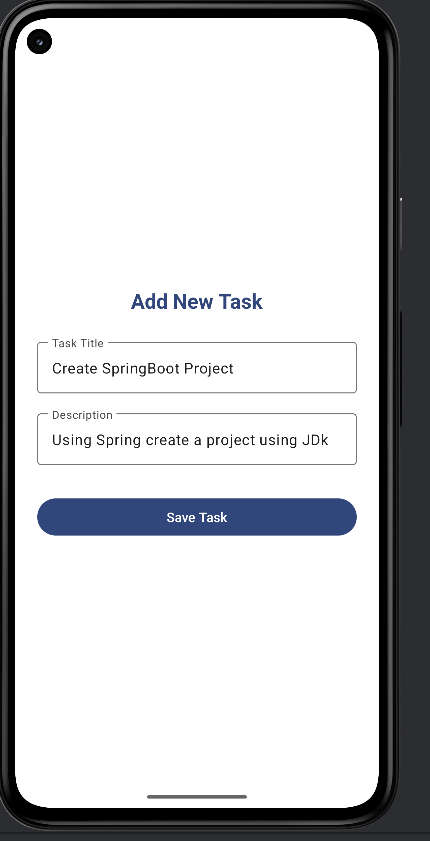
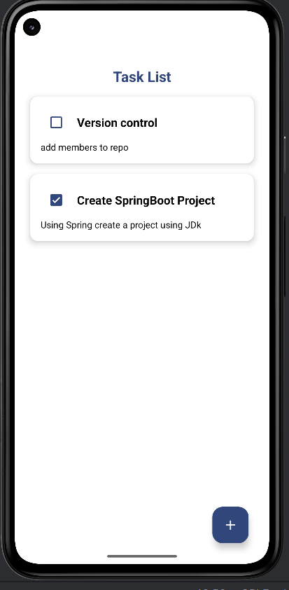
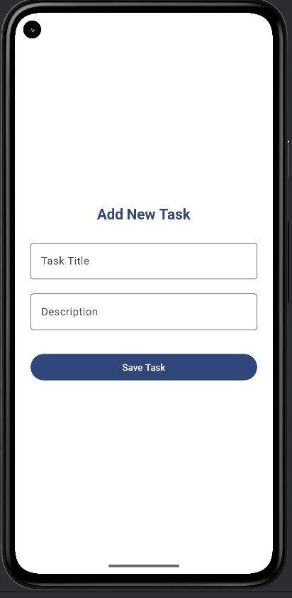

# SEN4302_14633_TaskManager

## App Description

The Task Manager App is a simple Android application that allows users to **create, view, edit, and manage personal tasks/notes**. The app demonstrates:

- Clean and user-friendly UI design
- Local data persistence
- State management for screen rotations
- Basic MVVM architecture
- Awareness of secure coding practices

Users can:

- Add new tasks with a title and optional description
- View a list of tasks in a **RecyclerView**
- Mark tasks as completed using a checkbox
- Edit a task (**click on an existing task to edit**)
- Delete tasks (**swipe task card**)
- Retain data after app restarts

---

## Screenshots

### Main Screen


### Add/Edit Task Screen


### Task Completed Example


### Add Task Screen


---

## Design Choices

- **Architecture:** MVVM (Model-View-ViewModel)
- **Data Persistence:** Room (SQLite abstraction)
- **UI Design:** Material Design guidelines with consistent colors, proper spacing, and clear labels
- **State Management:** ViewModel preserves unsaved text on screen rotations
- **Secure Coding Practices:**
    - Input validation to prevent invalid or empty tasks
    - Avoided hard-coded sensitive information

---

## Technical Details

- **Minimum SDK:** 26
- **Dependencies:** AndroidX, Material Design Components, Room
- **Offline Usage:** No internet required, all data stored locally
- **IDE:** Android Studio

---

## Installation & Usage

1. Clone the repository:

```bash
git clone https://github.com/AmadaKalubowila/SEN4302_14633_TaskManager.git