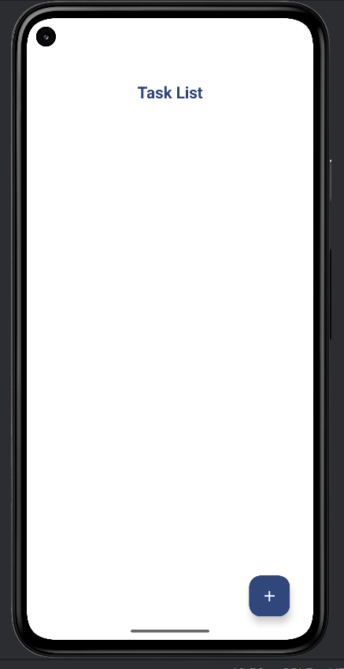

# SEN4302_14633_TaskManager

## **App Description**

The Task Manager App is a simple Android application that allows users to **create, view, edit, and manage personal tasks/notes**. The app demonstrates:

- Clean and user-friendly UI design
- Local data persistence
- State management for screen rotations
- Basic MVVM architecture
- Awareness of secure coding practices

Users can:

- Add new tasks with a title and optional description
- View a list of tasks in a **RecyclerView**
- Mark tasks as completed using a checkbox
- Edit task (**user have to click on exixting task to edit**)
- Delete tasks(**user have to swipe task card**)
- Retain data after app restarts

---

## **Screenshots**

### Main Screen (Task List)
<p align="center">
  
</p>

### Add/Edit Task Screen


### Task Completed Example


### Swipe to Delete Task

---

## **Design Choices**

- **Architecture:** MVVM (Model-View-ViewModel) for separation of concerns and state management  
- **Data Persistence:** Room (SQLite abstraction) used to store tasks locally, ensuring tasks persist across app restarts  
- **UI Design:** Material Design guidelines with consistent colors, proper spacing, and clear labels  
- **State Management:** ViewModel used to preserve unsaved text on screen rotations  
- **Secure Coding Practices:** 
  - Input validation to prevent invalid or empty tasks  
  - Avoided hard-coded sensitive information and ensured local data storage security  


## **Technical Details**

- **Minimum SDK:** 26  
- **Dependencies:** AndroidX, Material Design Components, Room  
- **Offline Usage:** No internet required, all data stored locally  
- **IDE:** Android Studio

---

## **Installation & Usage**

1. Clone the repository:

```bash
git clone https://github.com/AmadaKalubowila/SEN4302_14633_TaskManager.git
